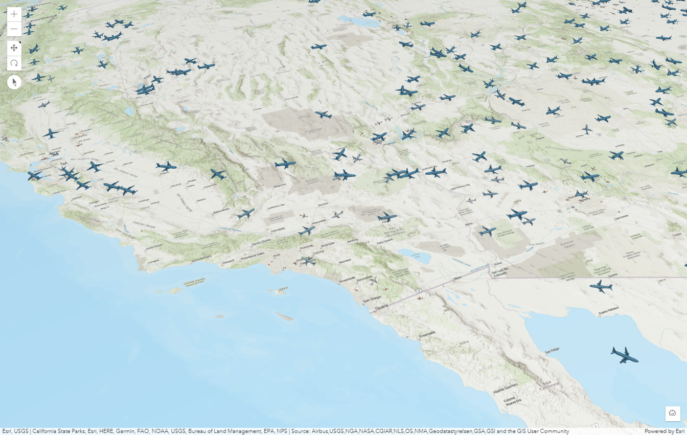
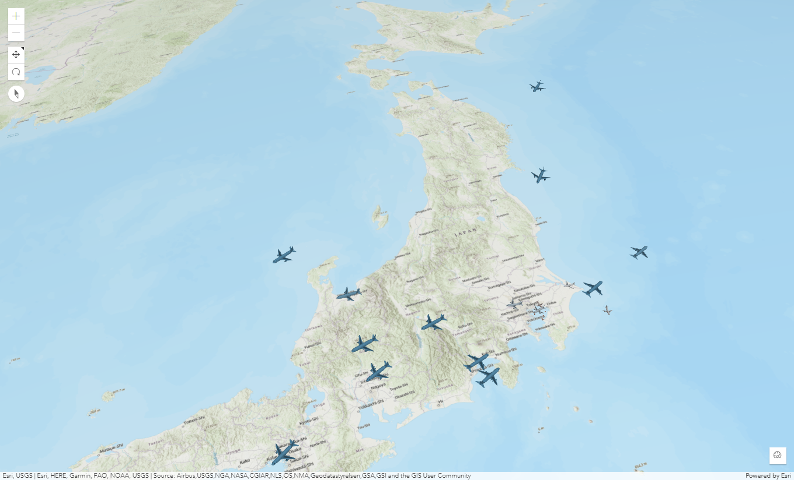

# flight data js app

Esri Developer Summit の「[ArcGIS Maps SDK for JavaScript: 3D Visualization](https://esridevevents.github.io/arcgis-maps-sdk-for-javascript-3d-visualization/)」 のセッション内で、flight-data のサンプルアプリケーションがデモされており、その [flight-data のコードは GitHub で公開](https://github.com/EsriDevEvents/arcgis-maps-sdk-for-javascript-3d-visualization/tree/main/src/samples/flight-data) されています。  
本ページは、その「AMD」モジュールでのJavaScript を使ったサンプルアプリケーションのコードを「[Add npm to existing ArcGIS JS API web app project](https://urbandatapalette.com/post/2021-06-arcgis-js-api-env-setup/)」 の手順でローカル Web サーバー で動作するように設定し、その後、日本の近郊の範囲でアプリケーションを動作させるまでの手順を記載しています。  

## flight-data のアプリケーションを自分で動作させるまでの手順  

### プロジェクト の設定
プロジェクト用のフォルダーを作成し、そのフォルダー下のコンソールで `npm init` コマンドを実行し、対話的にプロジェクト名 (project name), キーワード (keywords), 著者 (author), 等の情報を入力します。
これにより `package.json` ファイルが作成されます（対話的な入力が面倒な場合は、`npm init -y` でデフォルト設定で作成することも可能です）。

### git repo を設定

`git` から除外するために、`git init` を実行したルートフォルダーのターミナル内で  `.gitignore` ファイルを作成し、そのファイルに次のように除外する対象を記載します。

```
node_modules/*
.DS_Store
```

### アプリケーションの構成ファイルをコピー

[flight-data](https://github.com/EsriDevEvents/arcgis-maps-sdk-for-javascript-3d-visualization/tree/main/src/samples/flight-data) から、html, js, css の3つのファイルを、プロジェクト用のフォルダー下にコピーします。

- index.html
- main.js
- style.css

### ローカル Web サーバー のセットアップ と デバッグ開始
Web サーバー をセットアップするために、`browser-sync` をインストールします。これは変更をリッスンし、変更時にはページを再読み込みします。

```
npm install --save-dev browser-sync
```

package.json の`scripts` プロパティ を次のように変更します。:

```js
"scripts": {
  "test": "echo \"Error: no test specified\" && exit 1",
  "dev" : "browser-sync start --server -w"
},
```

デバッグの開始は、次のコマンドで可能です。
```
npm run dev
```
  


### コードの追加 1) 日本近郊の範囲や初期表示の座標を追加 

main.js 内で、日本近郊の範囲を定義し、extent に設定します。
```js
const extentJP = new Extent({
  xmin: 112.50000000,
  ymin: 21.94304553,
  xmax: 157.50000000,
  ymax: 55.77657302,
  spatialReference: SpatialReference.WGS84,
});

const extent = extentJP; //extentUS;
```

camera の初期表示の位置を変更します。
```js
const view = new SceneView({
  container: "viewDiv",
  map: map,
  viewingMode: "global",
  //clippingArea: extent,
  camera: {
    position: {
      spatialReference: { wkid: 4326 },  // 3857
      x: 135, //jp: 135, //us: -120, //eu: 8
      y: 30,   //jp: 30, //us: 27,  //eu: 40
      z: 1000000,
    },
    heading: 20,
    tilt: 40,
    },
});
```

### コードの追加 2) その他の設定変更 
`-- 1 --` として注釈が書かれている elevationInfoMode を "absolute-heigh" に設定します。
```js
const elevationInfoMode = "absolute-height"; 
```

`-- 4 --` として注釈が書かれている FeatureLayer のレンダラーを renderer3DObject に設定します。
```js
renderer: renderer3DObject,   // renderer2DIcon, renderer3DObject
```

`getFlightPosition()` 内のurl を opensky-opensky-network.org API (The OpenSky Network, http://www.opensky-network.org) から取得するURL へ切り替えます。  
なお、`Anonymous users get 400 API credits per day` の制限があるため、動作確認用には、予め json ファイルを用意しておくのがお勧めです。


```js
// Get the flight position form the https://opensky-network.org API
function getFlightPosition() {
  let url =
    "https://opensky-network.org/api/states/all?lamin=" +
    extent.ymin +
    "&lomin=" +
    extent.xmin +
    "&lamax=" +
    extent.ymax +
    "&lomax=" +
    extent.xmax;
  // add no real-time data,
  //let url = "./data/opensky_us-all-20230228-0146.json";
  //let url = "./data/opensky-jp-all-20230319-2323.json";
```

デバッグ開始状態の場合、main.js ファイルを保存すると、リロードされ日本近郊での飛行機に切り替えられます。



## 参考

今回は、「AMD」モジュールでのJavaScript を使ったアプリケーションの作成手順ですが、「AMD」モジュールでのTypeScript を使ったアプリケーションの作成手順は、「[チュートリアル - ArcGIS API for JavaScript を利用した 3D Web マッピングアプリケーション入門](https://github.com/kataya/get-started-arcgis-js-api/blob/master/README_ja.md)」 にあります。